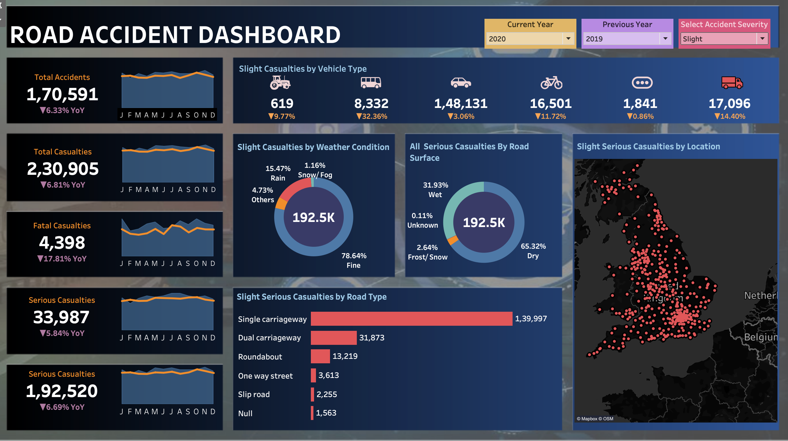

# 🚗 Road Accident Dashboard (Tableau)

An interactive Tableau dashboard that visualizes road accident data to uncover trends, identify high-risk areas, and support data-driven decision-making for traffic safety and urban planning.

---

## 📊 Features

- Accident trends over months/years
- Heatmap of accident locations
- Severity and casualty breakdown
- Contributing factors (weather, time, vehicle type)
- Interactive filters for deep exploration

---

## 🛠 Tools & Technologies

- Tableau Desktop (`.twbx`)
- Tableau Data Extract (`.hyper`)
- Custom dashboard visuals and filters

---

## 📁 Project Files

- `Road Accident Dashboard.twbx`: Main Tableau project file
- `dashboard.png`: Dashboard preview image (upload this manually)

---

## 🧑‍💻 How to Use

1. Clone or download this repo.
2. Open `Road Accident Dashboard.twbx` using **Tableau Desktop**.
3. Interact with filters and visuals to explore insights.

---

## 🖼 Dashboard Preview

---

## 📌 Insights & Applications

- Identify accident-prone zones and peak accident times.
- Support city traffic safety initiatives.
- Assist decision-makers in allocating resources and improving road conditions.

---

## 📬 Contact

Feel free to connect for collaboration or questions via GitHub Issues or Pull Requests.
